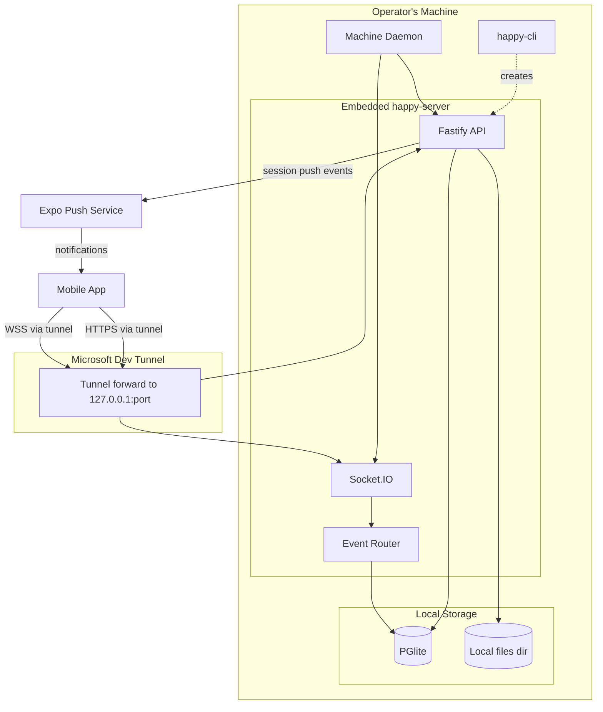
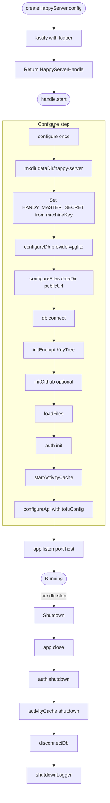
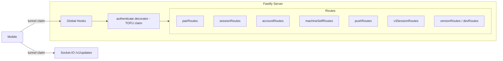
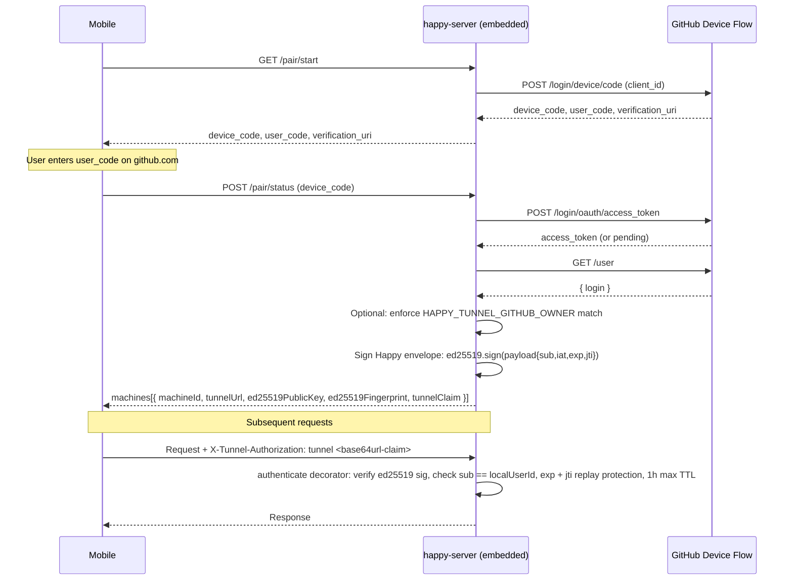
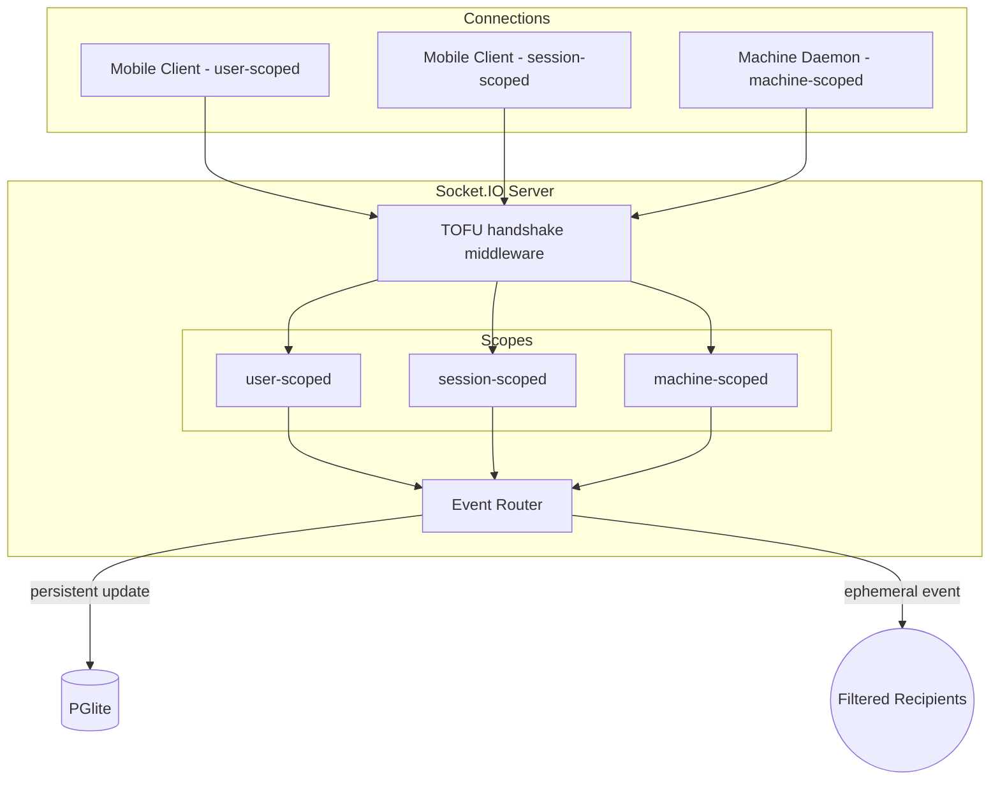
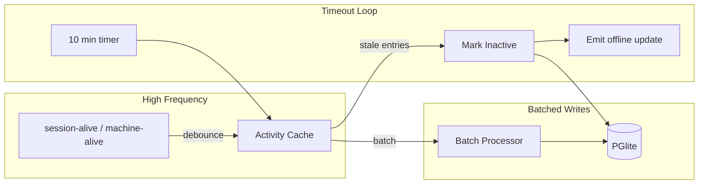
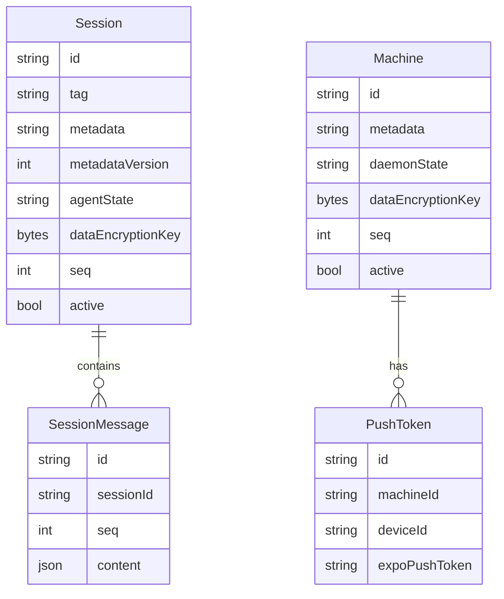
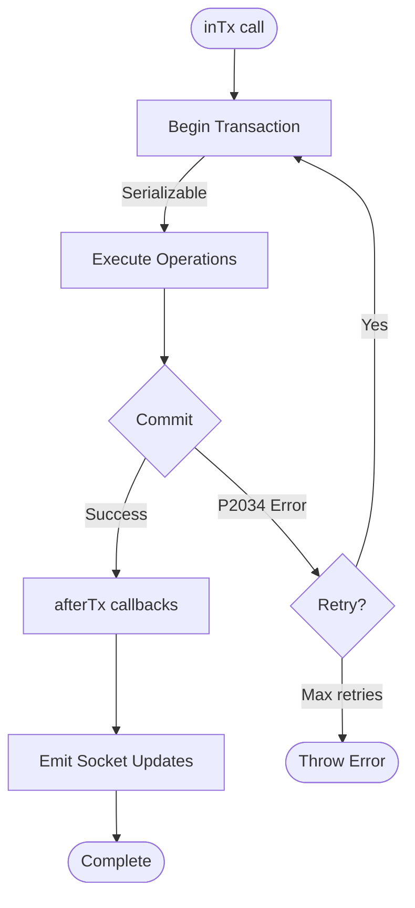
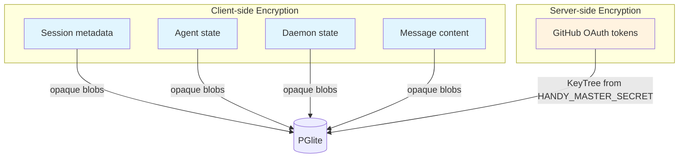

# Backend Architecture

This document describes the Happy backend structure as implemented in `packages/happy-server`. It focuses on how the server is wired, how data flows through the system, and which subsystems handle which responsibilities.

In the server-per-machine architecture, `happy-server` is no longer a multi-tenant cloud relay. Each machine runs its own embedded `happy-server` instance inside `happy-cli`, which is exposed to the operator's mobile device via a Microsoft Dev Tunnel. The standalone `main.ts` entry point is still available for running the server as a process (used in development), but the production deployment shape is "one server per machine, embedded in the CLI."

## System overview

## At a glance
- Runtime: Node.js + Fastify for HTTP, Socket.IO for realtime.
- Lifecycle: `createHappyServer()` factory in `packages/happy-server/sources/index.ts` starts Fastify in-process from `happy-cli`. A standalone `main.ts` is also retained for non-embedded use.
- Database: PGlite (embedded Postgres) by default via Prisma; external Postgres is opt-in for the standalone deployment shape.
- Cache/bus: Redis is optional. When `REDIS_URL` is set, the Socket.IO Redis-streams adapter is enabled for multi-process fan-out. In the embedded per-machine deployment Redis is not used.
- Blob storage: local filesystem (`<dataDir>/files`) by default; S3-compatible storage is opt-in when `S3_HOST` and friends are set.
- Auth: TOFU handshake middleware verifies `X-Tunnel-Authorization: tunnel <base64url-claim>` against the embedded server identity, one-hour `exp`, and replay-protected `jti`. Private Dev Tunnels gateway access is carried separately by `X-Tunnel-Connect`.
- Crypto: privacy-kit `KeyTree` derived from the per-machine `HANDY_MASTER_SECRET` (set by `createHappyServer()` from the configured `machineKey`). Used only for server-side service-token storage.
- Push: Expo push notifications are delivered directly from happy-server via `sendSessionPushEvent` to tokens stored per (machineId, deviceId).
- Metrics: Prometheus-style `/metrics` server + per-request HTTP metrics.

## Process lifecycle

The primary entry point is `createHappyServer()` in `packages/happy-server/sources/index.ts`, which is called from `happy-cli` to start the server in-process. The standalone `main.ts` simply wraps this factory for the non-embedded mode.

Startup sequence (inside `handle.start()` → `configure()`):
1. Create `<dataDir>/happy-server` and seed `HANDY_MASTER_SECRET` from the configured `machineKey` if it is not already set in the environment.
2. Configure storage:
   - `configureDb({ provider: "pglite", pgliteDir: <dataDir>/happy-server/pglite })` selects PGlite as the default Prisma adapter.
   - `configureFiles({ dataDir, publicUrl })` selects local-filesystem storage by default; S3 is enabled only when an explicit `s3` config is provided.
3. Connect Prisma (`db.$connect()`).
4. Initialize crypto modules:
   - `initEncrypt()` derives a KeyTree from `HANDY_MASTER_SECRET` for service-token encryption.
   - `initGithub()` configures the GitHub App / device-flow integration if env vars exist.
   - `loadFiles()` ensures the local files directory exists (or verifies S3 bucket access when S3 is configured).
   - `auth.init()` prepares legacy internal auth helpers; it no longer authenticates HTTP requests.
5. `startActivityCache()` starts the in-memory presence cache and its batch/cleanup timers.
6. `configureApi(app, tofuConfig)` registers all routes, sockets, and the TOFU `authenticate` decorator on the Fastify instance.
7. `app.listen({ port, host })` binds to the configured loopback address (default `127.0.0.1`).

The standalone `main.ts` additionally starts the metrics server, the database metrics updater, and the presence timeout loop, and registers shutdown hooks. The embedded path lets `happy-cli` decide whether to start those auxiliary loops.

Shutdown calls `handle.stop()`, which closes the Fastify app, shuts down the auth module and activity cache, disconnects the database (and closes the PGlite instance), and flushes the logger.

## API layer

`configureApi()` in `sources/app/api/api.ts` wires the HTTP server:
- Fastify instance with Zod validators/serializers (created via `createApi()`).
- Global hooks for monitoring and error handling.
- `authenticate` decorator that verifies the TOFU `X-Tunnel-Authorization: tunnel <claim>` header against the embedded server's `localUserId` and a 24-hour `iat` window.
- A `/files/*` static handler when local-filesystem storage is in use.
- Route modules under `sources/app/api/routes`.
- Socket.IO server attached at `/v1/updates` with the same TOFU handshake check in its middleware.

HTTP routes are organized by domain:
- Pairing (`pairRoutes`) - GitHub device-flow + TOFU handshake replacement for the old auth/connect flow.
- Self/account state (`accountRoutes`, `machineSelfRoutes`) - paired profile, local settings, and current machine state under `/v2/me/*`.
- Sessions + messages (`sessionRoutes`, `v3SessionRoutes`).
- Push tokens (`pushRoutes`).
- Version checks (`versionRoutes`).
- Dev-only logging (`devRoutes`).

Sprint E removed the obsolete route modules for artifacts, access keys, key-value store, users/friends/feed, voice, and the server-side machine directory. Multi-tenant account creation, GitHub OAuth-via-server callback, and challenge-based Bearer issuance no longer exist on the server.

## Authentication and pairing

The backend does not store accounts or passwords. Pairing happens entirely through GitHub's device flow plus TOFU pubkey pinning:

- `GET /pair/start` proxies to GitHub's `/login/device/code` and returns the user code + verification URI.
- `POST /pair/status` polls GitHub for the access token, fetches the GitHub user, optionally enforces `HAPPY_TUNNEL_GITHUB_OWNER`, and returns the embedded server's TOFU public keys (Ed25519 + X25519) along with a signed `tunnelClaim` - a base64url-encoded envelope `{ p: base64url(payload), s: hex(ed25519-signature) }` where payload is `{ sub, iat, exp, jti, accountId? }`. The mobile client trust-on-first-use pins the Ed25519 key and stores the claim.
- All subsequent HTTP and WebSocket calls present `X-Tunnel-Authorization: tunnel <claim>`. The `authenticate` decorator and Socket.IO middleware base64url-decode the claim, require `payload.sub === tofuConfig.localUserId`, enforce `exp`, and reject replayed `jti` values.

The claim is Ed25519-signed by the embedded server. Tunnel-facing routes and Socket.IO middleware base64url-decode the envelope, verify the signature against the configured Ed25519 public key, then check `sub === localUserId`, enforce `exp`, and reject replayed `jti` values from the in-memory cache. Optional `accountId` carries the GitHub numeric user id.

The refresh-per-request model is intentional: app and agent callers refresh the Happy claim before protected HTTP calls and Socket.IO handshakes, while `X-Tunnel-Connect` carries the private-tunnel gateway token independently.

The legacy `auth` module (`sources/app/auth/auth.ts`) still exists and is initialized at startup, but it is no longer used to authenticate HTTP requests. It is retained for internal helpers (e.g., the GitHub ephemeral token used by integrations) and for the standalone deployment shape.

## Realtime sync architecture

### Connection types
Socket.IO connections are tagged by scope at handshake time:
- `user-scoped`: receives all updates for the local user.
- `session-scoped`: receives updates only for one session.
- `machine-scoped`: daemon connections for machine state.

The Socket.IO middleware in `sources/app/api/socket.ts` enforces the same TOFU claim check as the HTTP layer before any connection is accepted, then attaches `userId`, `clientType`, `sessionId`, `machineId`, and the TOFU public keys to `socket.data`. On connection, it emits a `tofu-pubkeys` event so clients that connected via Socket.IO directly can perform the TOFU pin.

### Event router
`EventRouter` (`sources/app/events/eventRouter.ts`) maintains per-user connection sets and routes:
- **Persistent `update` events**: database-backed changes with a user-level monotonic `seq`.
- **Ephemeral events**: presence signals that are not persisted.

The router implements recipient filters so updates go only to interested connections (e.g., all session listeners or a specific machine).

### Update sequence numbers
- A per-user `seq` counter is allocated by `allocateUserSeq` and used as `UpdatePayload.seq`. There is no longer an `Account` row backing it; in the single-tenant schema the counter is maintained by the seq helper.
- Sessions and machines maintain their own `seq` for per-object ordering.

### Multi-process Redis adapter (optional)
When `REDIS_URL` is set, `startSocket()` attaches `@socket.io/redis-streams-adapter` so multiple server processes can share Socket.IO state and a `redisStreamLagMsGauge` metric tracks reader lag. The embedded per-machine deployment never sets `REDIS_URL`, so this code path is dormant.

## Presence and activity

Presence is handled in `sources/app/presence`:
- `session-alive` and `machine-alive` events are debounced in memory (`ActivityCache`) with a 30-second TTL and a 5-second batch interval.
- Database writes are batched to reduce write load.
- A timeout loop marks sessions/machines inactive after 10 minutes of silence and emits an offline ephemeral update.

This splits high-frequency presence from durable storage updates.

## Storage and persistence

### Database (Prisma)

The schema in `prisma/schema.prisma` is single-tenant — there is no `Account`, `GithubUser`, or `AccountPushToken` model. All entities belong to the single embedded server's local user.

Key tables:
- `Session` + `SessionMessage`: encrypted session metadata and message blobs.
- `Machine`: encrypted machine metadata + daemon state for the local machine and any peer machines.
- `PushToken`: per-`(machineId, deviceId)` Expo push tokens. The previous `AccountPushToken` model has been replaced by this single-tenant table.

### Transactions and retries

`inTx()` wraps Prisma transactions with:
- Serializable isolation.
- Automatic retry on `P2034` (serialization failures).
- `afterTx()` to emit socket updates after commit.

This pattern is used for multi-write operations like session deletion.

### Blob storage (local-first)
The default storage backend is the local filesystem under `<dataDir>/files`:
- `storage/files.ts` exposes `configureFiles({ dataDir, publicUrl, s3? })`. With no `s3` config, `useLocalStorage` is `true` and `loadFiles()` simply ensures the local directory exists.
- A `/files/*` route is registered on the Fastify instance when local storage is in use, serving files within the configured directory.

S3-compatible storage is opt-in. Provide an `s3` block (or set `S3_HOST`/`S3_BUCKET`/`S3_PUBLIC_URL`/etc.) and the same module switches to MinIO-style uploads with public URLs derived from `S3_PUBLIC_URL`.

### Redis (optional)
A Redis client is no longer constructed at startup. Redis is consulted only by the Socket.IO multi-process adapter, which is enabled lazily when `REDIS_URL` is set. The embedded per-machine deployment runs without Redis.

## Push notifications

Push delivery is owned by happy-server in the per-machine architecture. The CLI no longer talks to Expo directly.

- `pushRoutes` exposes `POST /push/register`, `POST /v1/push-tokens`, `DELETE /v1/push-tokens/:token`, and `GET /v1/push-tokens`. All four endpoints are gated by the `authenticate` decorator and bind tokens to the `tofuConfig.localUserId` plus a per-device `deviceId`.
- `registerPushToken` upserts a row in the `PushToken` table keyed by `(machineId, deviceId)`.
- `sendSessionPushEvent` (in `sources/app/push/pushNotifications.ts`) is called from session-update handlers to push a notification for `new-session`, `status-change`, `agent-message`, or `codex-finish` events. It calls `https://exp.host/--/api/v2/push/send` directly with a body that includes `to`, `title`, `body`, `sound: "default"`, `priority: "high"`, and a `data` payload with `machineId`, `sessionId`, `kind`, and a deep-link `url`.
- Failed responses are logged but do not block the calling write transaction.

## Data confidentiality model

- Session metadata, agent state, daemon state, and message content are stored as opaque encrypted strings or blobs.
- The server only encrypts/decrypts GitHub OAuth material it owns using the KeyTree derived from `HANDY_MASTER_SECRET`. In the embedded deployment that secret is the per-machine `machineKey` configured by `happy-cli`, not a shared cloud master.

## Integrations
- **GitHub**: device-flow OAuth used inside `pairRoutes` to authenticate the operator and (optionally) enforce ownership via `HAPPY_TUNNEL_GITHUB_OWNER`. The legacy multi-tenant GitHub callback / connect flow is no longer wired into HTTP routes.
- **Push tokens**: stored per `(machineId, deviceId)` for direct Expo delivery.

## Observability
- `/health` route checks DB connectivity.
- Metrics server exposes `/metrics` for Prometheus.
- HTTP request counters and duration histograms are captured via Fastify hooks.
- WebSocket event counters and connection gauges are in `metrics2.ts`.

## Key implementation references
- Embedded factory: `packages/happy-server/sources/index.ts` (`createHappyServer`)
- Standalone entrypoint: `packages/happy-server/sources/main.ts`
- API server: `packages/happy-server/sources/app/api/api.ts`
- TOFU handshake middleware: see `authenticate` decorator and Socket.IO `io.use` block in `app/api/api.ts` and `app/api/socket.ts`
- Pairing routes: `packages/happy-server/sources/app/api/routes/pairRoutes.ts`
- Push notifications: `packages/happy-server/sources/app/push/pushNotifications.ts`, `packages/happy-server/sources/app/api/routes/pushRoutes.ts`
- Socket server: `packages/happy-server/sources/app/api/socket.ts`
- Event routing: `packages/happy-server/sources/app/events/eventRouter.ts`
- Presence: `packages/happy-server/sources/app/presence`
- Storage: `packages/happy-server/sources/storage`
- Prisma schema: `packages/happy-server/prisma/schema.prisma`
