# CLI Architecture

This document describes the Happy CLI (`packages/happy-cli`) and its daemon. The CLI is both an interactive tool and a background session manager that hosts an embedded `happy-server` and exposes it to the mobile/web clients via a Microsoft Dev Tunnel.

## System overview

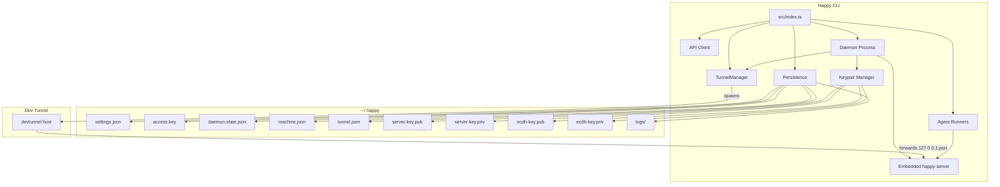

## High-level layout
- **Entry point:** `src/index.ts` parses subcommands and routes execution.
- **API client:** `src/api` handles HTTP + Socket.IO, encryption, and RPC.
- **Daemon:** `src/daemon` runs in the background, hosts the embedded `happy-server`, spawns sessions, and maintains machine state.
- **Tunnel manager:** `src/tunnel/tunnelManager.ts` owns Microsoft Dev Tunnel lifecycle (login, create, port mapping, host, renewal).
- **TOFU keypair manager:** `src/tofu/keypairManager.ts` loads or creates the long-term Ed25519 server identity and X25519 ECDH keys.
- **Persistence/config:** `src/persistence.ts` + `src/configuration.ts` manage local state in `~/.happy`.
- **Agents:** `src/claude`, `src/codex`, `src/gemini` provide provider-specific runners.

## CLI entry flow

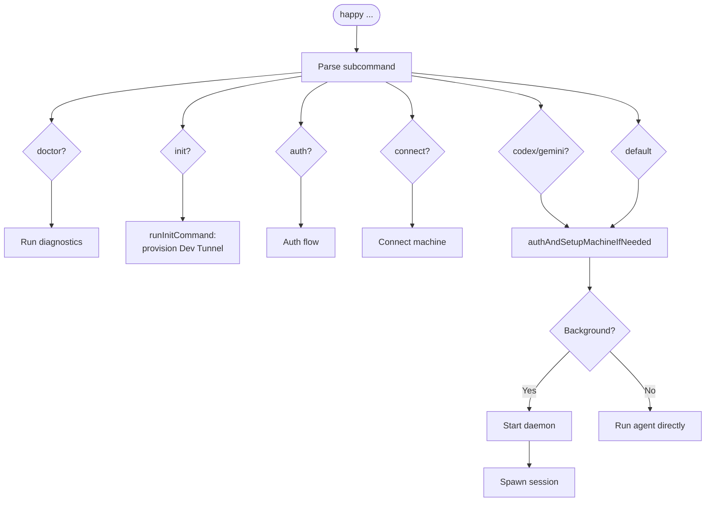

`src/index.ts` is the CLI router. It:
- Parses subcommands (`doctor`, `init`, `auth`, `connect`, `codex`, `gemini`, and default run flows).
- Routes `happy init` to `runInitCommand` from `src/tunnel/tunnelManager.ts`, which provisions the Microsoft Dev Tunnel and writes `~/.happy/tunnel.json`.
- Ensures auth and machine setup when needed (`authAndSetupMachineIfNeeded`).
- Starts the daemon or runs an agent directly based on subcommand/context.

`happy init` is a one-time provisioning step run by the human operator before the daemon can start. It picks/reuses a free loopback port, writes it to `~/.happy/machine.json`, ensures the operator is logged into Dev Tunnels (GitHub device flow), creates or reuses the named tunnel `happy-<host>-<machineId>`, configures the port, and persists `tunnel.json` with the resulting public `tunnelUrl`.

## Local state and configuration

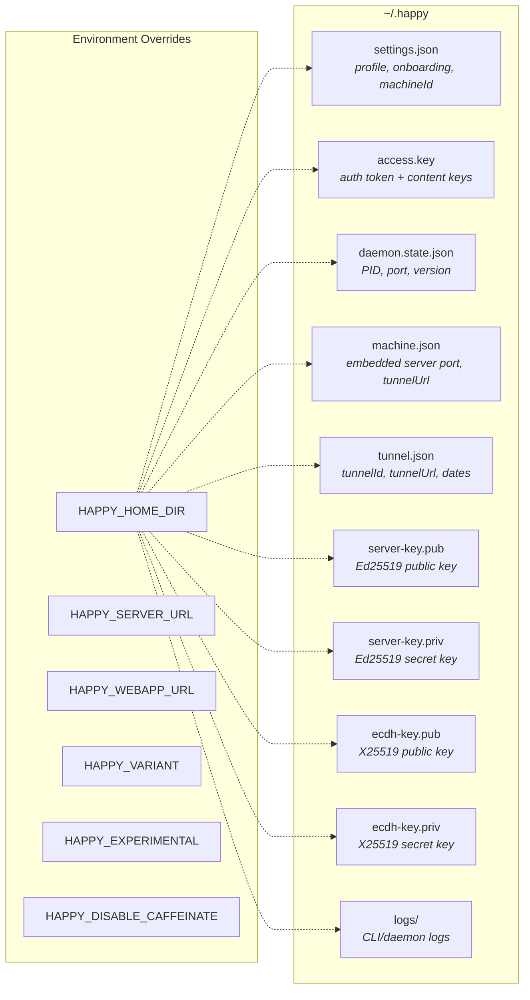

Local state lives under `~/.happy` (or `HAPPY_HOME_DIR`):
- `settings.json`: onboarding, profile settings, and `machineId` (validated/migrated).
- `access.key`: local auth token and content encryption keys.
- `daemon.state.json`: daemon PID + control port + version.
- `machine.json`: embedded `happy-server` loopback port and last-known `tunnelUrl`.
- `tunnel.json`: Dev Tunnel record (`tunnelId`, `tunnelName`, `tunnelUrl`, `createdAt`, optional `refreshedAt`).
- `server-key.pub` / `server-key.priv`: long-term Ed25519 keypair that defines this machine's TOFU identity. The SHA-256 fingerprint of the public key is what mobile clients pin on first pair.
- `ecdh-key.pub` / `ecdh-key.priv`: legacy TOFU public-key material still surfaced for compatibility; RPC payload encryption is no longer derived from it.
- `logs/`: CLI/daemon logs.

The `~/.happy` directory itself is created with mode `0700`. All four key files are written `0600` on POSIX and locked down via `icacls` on Windows.

Configuration lives in `src/configuration.ts`:
- `HAPPY_SERVER_URL` and `HAPPY_WEBAPP_URL` override defaults.
- `HAPPY_VARIANT`, `HAPPY_EXPERIMENTAL`, `HAPPY_DISABLE_CAFFEINATE` control behavior.

## API client architecture

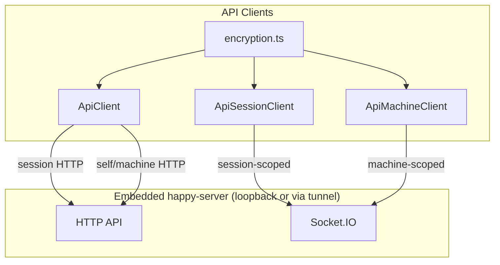

### HTTP
`ApiClient` (`src/api/api.ts`) handles session HTTP calls with encrypted metadata/state and wires tunnel-authenticated clients for the embedded server. The server-side machine directory was removed in Sprint E; machine discovery now comes from locally persisted Dev Tunnel credentials and `/v2/me/machine`, while daemon state flows through the Socket.IO machine scope.

### WebSocket

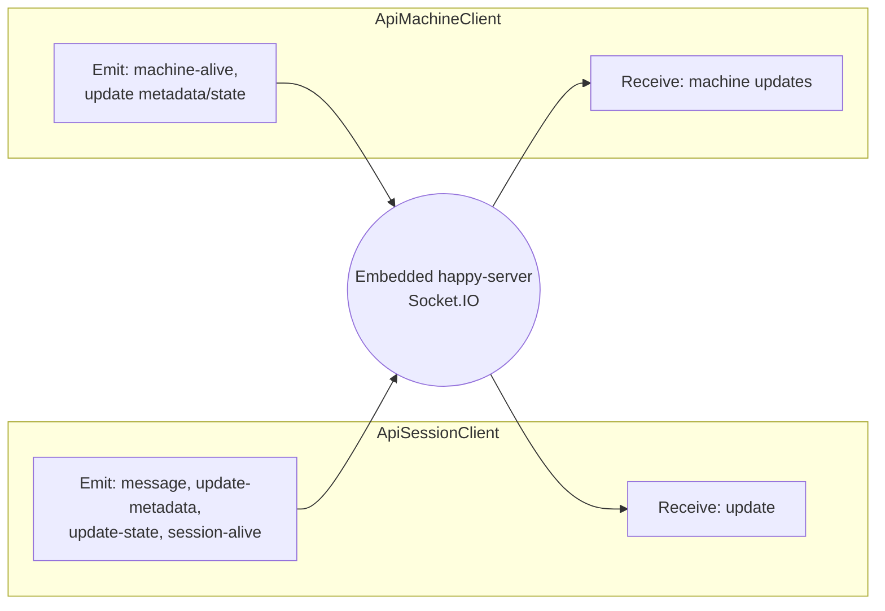

`ApiSessionClient` (`src/api/apiSession.ts`) connects to Socket.IO as a **session-scoped** client:
- Receives `update` events and decrypts message content.
- Emits `message`, `update-metadata`, `update-state`, and `session-alive`.

`ApiMachineClient` (`src/api/apiMachine.ts`) connects as a **machine-scoped** client:
- Sends `machine-alive` heartbeats.
- Updates machine metadata/daemon state with optimistic concurrency.
- Receives machine updates and merges them locally.

### Authentication And Gateway Access

CLI and daemon traffic uses two independent credentials when crossing a private Dev Tunnel:

- `X-Tunnel-Authorization: tunnel <connect-jwt>` carries the Dev Tunnels connect token (Microsoft's gateway auth scheme; obtained through `ClientTunnelProvider.getConnectToken(tunnelId)`). The Dev Tunnels gateway consumes and strips this header before forwarding to the backend.

`src/tunnel/tunnelManager.ts` creates private tunnels and must not add anonymous access flags. The app and happy-agent refresh Dev Tunnels connect tokens before tunnel HTTP/Socket.IO calls.

### Encryption

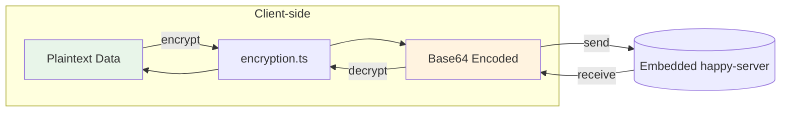

The CLI encrypts client content before it leaves the machine using `src/api/encryption.ts`.
- Session metadata, agent state, messages, and machine state are encrypted client-side.
- On-wire encoding is base64; see `encryption.md`.
- RPC params and responses are plaintext JSON over TLS plus Dev Tunnels gateway auth. Session content encryption remains for message bodies, metadata, and state fields.

## Daemon architecture

Session fan-out uses `src/daemon/spawnInWorktree.ts` for transactional worktree creation and process launch. The transaction record tracks worktree creation, process spawn, and session registration so crash recovery can roll back partial spawns without leaving orphan worktrees.

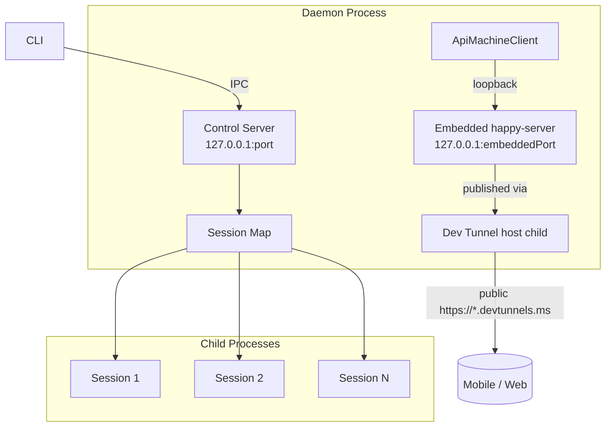

The daemon is a long-lived process responsible for hosting the embedded `happy-server`, exposing it via a Dev Tunnel, running sessions in the background, and maintaining machine presence.

### Lifecycle

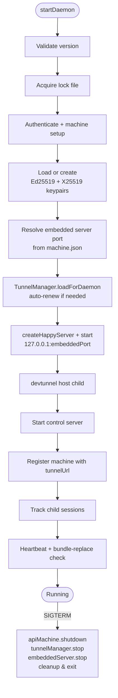

1. `startDaemon()` validates the running version and acquires a lock file.
2. It authenticates and resolves the local `machineId`.
3. It loads or creates the TOFU keypairs via `loadOrCreateTofuKeypairs(...)`. On first creation, the Ed25519 fingerprint (`SHA256:...`) is printed so the operator can confirm it during mobile pairing.
4. It resolves the embedded server port from `machine.json` (creating one with `pickFreeLoopbackPort` if absent).
5. It calls `TunnelManager.loadForDaemon(port)`, which fails fast if `happy init` has not been run, otherwise renews the tunnel if it is past `RENEW_AFTER_DAYS` (25) or within `RENEW_WITHIN_EXPIRY_DAYS` (7) of expiry, and ensures the loopback port is configured on the tunnel.
6. It calls `createHappyServer(...)` (from the workspace `happy-server` package) with the resolved port, machine key, local user id, public `tunnelUrl`, and TOFU public keys, then `start()`s it.
7. It calls `tunnelManager.startHost(...)`, which spawns a detached `devtunnel host <tunnelId> --port-number <port>` child that forwards public traffic to the loopback port.
8. It starts the local **control server** for IPC.
9. It registers the machine with the upstream coordination service (the metadata payload now includes `tunnelUrl`) and keeps a map of tracked child sessions.

### Control server (local IPC)

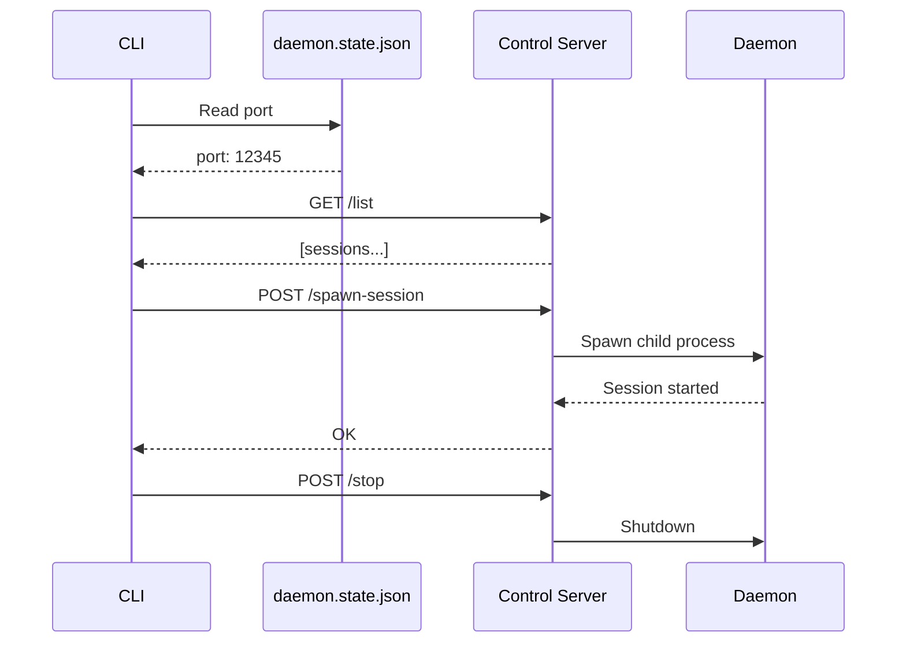

`startDaemonControlServer()` (`src/daemon/controlServer.ts`) runs an HTTP server on `127.0.0.1` and exposes:
- `/list` (list active sessions)
- `/stop-session`
- `/spawn-session`
- `/stop` (shutdown daemon)
- `/session-started` (session self-report)

The CLI talks to this server via `controlClient.ts`, using a port stored in `daemon.state.json`. This is distinct from the embedded `happy-server`'s port (stored in `machine.json`).

### Session spawning

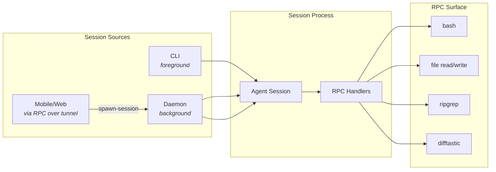

Sessions can be started by:
- The CLI directly (foreground).
- The daemon (background).
- Remote requests over RPC (from mobile/web, reaching the embedded `happy-server` via the Dev Tunnel).

Daemon session spawning uses `registerCommonHandlers` to expose a controlled RPC surface (shell commands, file operations, search/diff helpers, and the atomic `spawn-in-worktree` RPC that creates a UUID-named worktree, spawns a tracked Happy process, and records the txn through `worktreeCreated -> processSpawned -> sessionRegistered` with crash-recovery rollback). See `packages/happy-cli/src/daemon/CLAUDE.md` "Worktree Spawn Transactions" for the transaction record and rollback details.

### Machine state

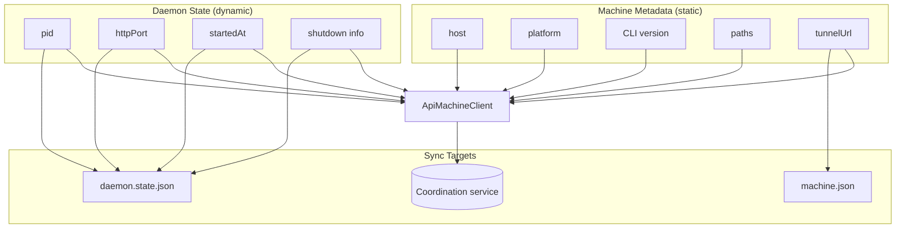

- **Machine metadata** is mostly static (host, platform, CLI version, paths) but now also carries the public `tunnelUrl` so other clients can reach the embedded server.
- **Daemon state** is dynamic (pid, httpPort, startedAt, shutdown info).

The daemon updates these via `ApiMachineClient`, mirrors local control state into `daemon.state.json`, and persists the embedded server port + last-known tunnel URL into `machine.json` for control/diagnostics.

## RPC and tool bridge

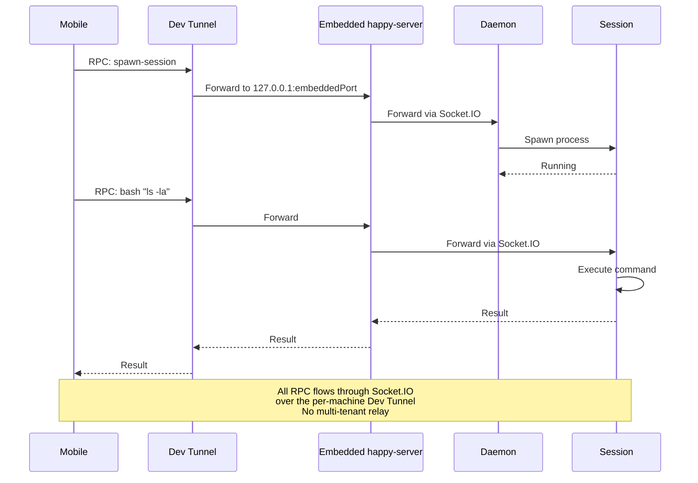

RPC is used to send commands over the Socket.IO connection:
- Sessions register RPC handlers (e.g., `bash`, file read/write, `ripgrep`, `difftastic`).
- The daemon registers a spawn-session handler so the mobile/web client can ask it to start a local session.

This mechanism allows mobile clients to drive local actions through the per-machine embedded server without exposing a broad REST surface to the public internet — only the loopback port, published through the Dev Tunnel, is reachable.

## Implementation references
- CLI entry: `packages/happy-cli/src/index.ts`
- Daemon: `packages/happy-cli/src/daemon`
- Daemon lifecycle (embedded server + tunnel host): `packages/happy-cli/src/daemon/run.ts`
- Control server/client: `packages/happy-cli/src/daemon/controlServer.ts`, `packages/happy-cli/src/daemon/controlClient.ts`
- Tunnel manager + `happy init`: `packages/happy-cli/src/tunnel/tunnelManager.ts`, `packages/happy-cli/src/tunnel/types.ts`
- TOFU keypair manager: `packages/happy-cli/src/tofu/keypairManager.ts`
- Embedded server contract: `packages/happy-cli/src/types/happy-server.d.ts` (workspace dependency on `happy-server`)
- API clients: `packages/happy-cli/src/api`
- Persistence: `packages/happy-cli/src/persistence.ts`
- Config: `packages/happy-cli/src/configuration.ts`
